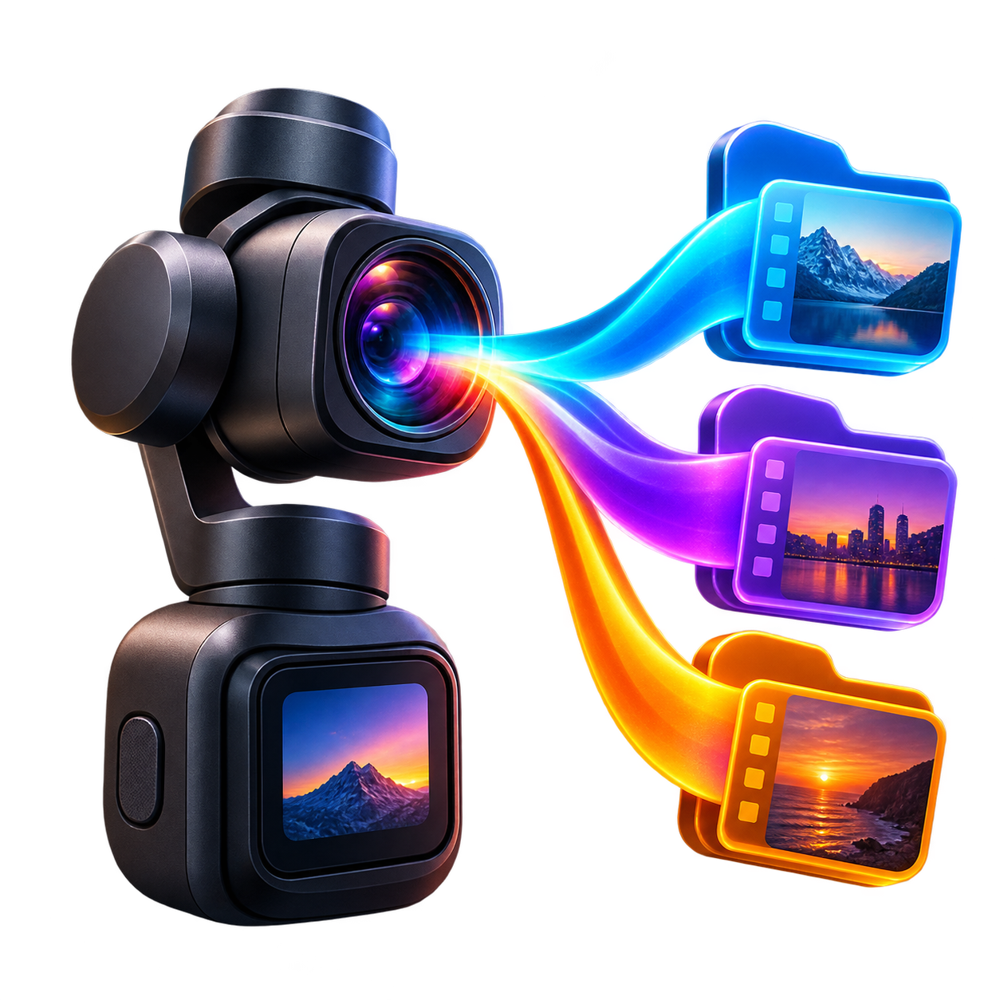

# Pocket Log Sorter

<p align="center">
  
</p>

一个面向 macOS 的本地视频色彩模式识别与分拣工具。它读取 DJI Pocket 素材中的私有 `djmd` 元数据和标准 QuickTime 色彩信息，区分 D-Log 2、D-Log、D-Log M、HLG、HDR/PQ、普通 Rec.709，并将素材复制或移动到不同文件夹，方便在后期批量套用正确的 LUT。

> Pocket Log Sorter 是独立开源项目，与 DJI 无隶属或官方合作关系。DJI、Osmo 和 Pocket 是其各自权利人的商标。

## 功能

- 拖拽视频或整个素材文件夹。
- 点击“选择文件”批量添加 MP4、MOV、M4V。
- 自动匹配视频同目录下的同名 `.LRF` 代理文件，并优先使用它快速生成缩略图。
- 在深色工作台中按色彩格式显示视频缩略图、时长、判定依据和分组数量。
- 内置视频播放器，可直接播放 LRF 代理或切换到原视频。
- 环形图显示各色彩格式的素材数量与占比。
- 支持全选、取消全选和任意多选，只导出勾选的素材。
- 上半部分播放器和导出控制保持固定，仅下方格式分组区域滚动。
- 原生读取 MP4/MOV 中的 DJI `djmd` 私有轨道，无需 FFmpeg、ExifTool 或 Python。
- 自动识别 D-Log 2、D-Log 和普通 Rec.709。
- 兼容 D-Log M、HLG、PQ/Dolby Vision HDR 标记。
- 自动创建分类文件夹，默认复制原片。
- 可选让匹配的 LRF 跟随原片导出到同一分类目录。
- 同名文件自动追加序号，绝不覆盖已有文件。
- 无法可靠判断的素材进入 `99_待确认`，避免使用错误 LUT。
- Universal Binary，同时支持 Apple Silicon 与 Intel Mac。
- 所有分析均在本地完成，不上传视频。

## 快速使用

1. 从 [Releases](https://github.com/Jinshuang1996/pocket-log-sorter/releases) 下载 DMG，或在本地运行 `./build_dmg.sh`。
2. 打开 DMG，将应用拖入“应用程序”。
3. 启动应用，点击左侧“点击导入”，也可以直接拖入素材。
4. 在底部按格式浏览缩略图；点击卡片即可在上方播放，并查看真实判定依据。
5. 使用卡片右上角勾选框选择需要导出的素材，也可以点击“全选”。
6. 在右侧选择输出目录，保持“复制原片”，点击“导出已选”。

DJI 素材目录中若存在 `DJI_0001.MP4` 与 `DJI_0001.LRF`，程序会自动关联两者。LRF 只用于快速预览，不参与色彩格式判断；判断始终来自原视频元数据。

详细操作、Gatekeeper 提示和故障排查见 [使用说明](docs/USAGE.md)。

## 分类结果

| 文件夹 | 色彩模式 | 主要依据 |
|---|---|---|
| `01_D-Log_2` | DJI D-Log 2 | `djmd ColorGammaSxS = 22` |
| `02_D-Log` | DJI D-Log | `djmd ColorGammaSxS = 2` |
| `03_D-Log_M` | DJI D-Log M | QuickTime 色彩描述 |
| `04_HLG` | Rec.2100 HLG | HLG / ARIB STD-B67 标记 |
| `05_HDR` | PQ / Dolby Vision HDR | SMPTE ST 2084、Dolby Vision 或 BT.2020 |
| `06_Normal_Rec709` | 普通 Rec.709 | `ColorGammaSxS` 缺失且 `record_mode = 8`，或 DJI 明确标记 Rec.709 |
| `99_待确认` | 无法安全识别 | 元数据缺失、未知固件值或格式不受支持 |

## 系统要求

- macOS 13 Ventura 或更新版本
- Apple Silicon 或 Intel 64 位处理器
- 构建源码需要 Xcode Command Line Tools

## 从源码构建

```bash
git clone https://github.com/Jinshuang1996/pocket-log-sorter.git
cd pocket-log-sorter
./test.sh
./build.sh
./build_dmg.sh
```

生成文件位于 `dist/`：

```text
dist/
├── Pocket色彩分拣器.app
└── Pocket色彩分拣器-通用版.dmg
```

## 文档

- [使用说明](docs/USAGE.md)
- [代码与架构说明](docs/CODE_GUIDE.md)
- [开发、构建与发布](docs/DEVELOPMENT.md)
- [第三方许可](THIRD_PARTY_NOTICES.txt)

## 当前限制

- 原生读取器支持常见的非 fragmented MP4/MOV；检测到 `moof` 的 fragmented MP4 时会放入待确认。
- DJI 可能通过固件增加新的枚举值。未知值不会被猜测，需要样片或公开元数据才能添加。
- 没有 DJI 私有字段时，只能依据标准色彩标记；仅看到 BT.709 不足以断定普通模式，因为部分 Log 文件也会使用 BT.709 容器标签。
- 未经 Apple Developer ID 签名与公证的自行构建版本，首次启动可能需要右键选择“打开”。

## 贡献

欢迎提交 Issue 或 Pull Request。添加新机型/固件映射时，请同时提供匿名化的元数据证据和测试用例，不要上传包含序列号、地理位置或个人画面的原始素材。

## License

本项目采用 [MIT License](LICENSE)。DJI `djmd` 字段路径的实现参考了 Ray Lei 的 MIT 项目 `dlog_color_classifier`，完整声明见 [THIRD_PARTY_NOTICES.txt](THIRD_PARTY_NOTICES.txt)。
