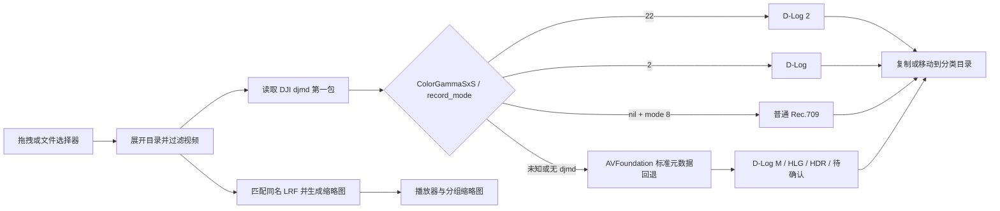

# 代码与架构说明

本文面向希望理解识别原理、审查安全性或扩展新 DJI 机型的开发者。

## 1. 总体流程



应用不会用画面内容猜测色彩格式。缩略图仅解码 LRF 或原视频中的单帧；识别仍然依赖相机写入的拍摄元数据，因此不会因画面曝光或调色而误判。

## 2. 源码文件

| 文件 | 职责 |
|---|---|
| `PocketColorSorter.swift` | SwiftUI 界面、文件选择/拖拽、任务状态、标准色彩元数据回退和文件整理 |
| `DjiMetadataReader.swift` | ISO BMFF box 解析、定位 `djmd` sample、未知 schema protobuf 解析 |
| `DjiMetadataReaderTests.swift` | 用最小合成 MP4 验证 D-Log 2、D-Log、普通模式字段路径 |
| `Info.plist` | Bundle ID、版本、最低系统、应用图标配置 |
| `build.sh` | 生成双架构 Universal Binary、`.icns`、签名后的 `.app` |
| `build_dmg.sh` | 生成带“应用程序”快捷方式和安装说明的压缩 DMG |
| `test.sh` | 编译并运行元数据读取测试 |

## 3. `djmd` 读取器

### 3.1 ISO BMFF box 遍历

`DjiMetadataReader` 只实现定位第一条 DJI 元数据 sample 所需的 MP4/MOV 子集。它从顶层查找 `moov`，随后遍历每个：

```text
moov/trak/mdia/minf/stbl
```

读取的 sample table box：

- `stsd`：判断 sample entry type 是否包含 `djmd`。
- `stsz` / `stz2`：取得第一条 sample 的大小。
- `stsc`：取得第一条 chunk 与每 chunk sample 数。
- `stco` / `co64`：取得第一条 chunk 的文件偏移。

box size 同时支持 32 位 size、64 位 large size 和延伸到父 box 末尾的 size 0。每次读取都会检查边界，避免损坏文件导致越界。

发现顶层 `moof` 时，读取器返回不支持 fragmented MP4 的错误。上层把错误降级为标准元数据回退或“待确认”，不会中断其他文件。

### 3.2 无 schema protobuf 解析

DJI `djmd` sample 使用嵌套 protobuf。项目没有依赖 `.proto` 文件，而是保留字段号、wire type 和值的轻量递归解析器。

支持的 wire type：

- `0`：varint
- `1`：64 位数据
- `2`：length-delimited 嵌套消息
- `5`：32 位数据

最大递归深度为 8。遇到非法 varint、越界长度或未知 group wire type 时保守停止解析。

### 3.3 当前字段路径

```text
ColorGammaSxS: top.field(2)[0].field(2)[0].field(3)[0].field(1)
record_mode:   top.field(2)[0].field(3)[0].field(5)
```

映射：

```swift
ColorGammaSxS == 22  // D-Log 2
ColorGammaSxS == 2   // D-Log
ColorGammaSxS == nil && record_mode == 8 // 普通 Rec.709
```

该字段路径参考 MIT 许可项目 `dlog_color_classifier`；许可文本保留在 `THIRD_PARTY_NOTICES.txt`。

## 4. 标准元数据回退

`Detector.inspect` 优先调用 `DjiMetadataReader`。无法获得已知映射时，使用 AVFoundation 枚举：

- Asset metadata formats、identifier、key space、key、value。
- 视频 track 的 `CMFormatDescription` extensions。

归一化成小写文本后按优先级判断：

1. D-Log 2
2. D-Log M
3. D-Log
4. Rec.2100 HLG / ARIB STD-B67
5. SMPTE ST 2084 / Dolby Vision / PQ
6. BT.2020
7. DJI 明确标记 Rec.709
8. 待确认

仅有 BT.709 时不归入普通模式，这是有意的安全策略。

## 5. LRF 匹配与缩略图

`ThumbnailLoader.companionLRF` 枚举视频所在目录，并按以下规则查找代理文件：

1. 扩展名忽略大小写后为 `lrf`。
2. 去掉扩展名后的文件名与视频完全相同，比较时忽略大小写。

找到 LRF 后，`AVAssetImageGenerator` 在大约 8% 时长、最多第 1 秒处抽取一帧，输出尺寸限制为 720×405。LRF 解码失败时重新对原视频执行同一流程。此过程不改变 `Detector.inspect` 的输入；色彩模式始终从原视频读取。

## 6. 并发与 UI 状态

`SorterModel` 标记为 `@MainActor`，所有 SwiftUI 状态更新都发生在主 actor。每个视频的磁盘和元数据读取通过 `Task.detached` 执行，避免大型批次冻结界面。

每个 `MediaItem` 独立保存：

- 源 URL
- 分析状态
- `DetectionResult`
- 缩略图和时长
- 匹配的 LRF URL
- 文件操作错误

`selectedForExport` 使用 `Set<UUID>` 保存多选状态。活动播放器素材和导出选择互相独立：点击卡片只改变 `activeID`，点击卡片勾选框才改变导出集合。`sort()` 在处理每个条目前先检查该集合，因此未选择的视频不会发生文件操作。

上半区使用固定布局，`VideoPlayer`、环形占比图和导出控件不会跟随素材列表移动。下半区使用同时支持水平与垂直方向的 `ScrollView`；格式列和大量缩略图只在该区域内滚动。

`DonutChartView` 根据每个 `ColorProfile` 的实际数量计算累计区间，用多个旋转后的 `Circle.trim` 绘制环形分段，不依赖第三方图表库。

## 7. 文件整理安全策略

应用支持复制和移动：

- 使用 `FileManager.createDirectory` 按需创建目标目录。
- `uniqueDestination` 在冲突时追加 `_2`、`_3`，不会覆盖。
- 单个文件失败只记录到该行，不阻止后续文件。
- 未知模式使用独立目录，避免错误 LUT 污染工作流。
- 启用“同时导出匹配的 LRF”时，代理文件与视频进入同一目录；LRF 失败不会回滚已成功导出的视频。

## 8. 测试设计

测试不包含真实用户视频。`DjiMetadataReaderTests.swift` 在运行时构造最小 MP4：

```text
ftyp + mdat(djmd protobuf) + moov/trak/mdia/minf/stbl
```

测试矩阵：

| 输入 | 期望 |
|---|---|
| `ColorGammaSxS = 22` | D-Log 2 |
| `ColorGammaSxS = 2` | D-Log |
| `record_mode = 8`，无 gamma | 普通 Rec.709 |

增加新映射时应先添加失败测试，再扩展分类规则。

## 9. 扩展建议

### 添加新的枚举值

1. 确认它来自未转码的原始素材。
2. 用至少两台设备或多个样本交叉验证。
3. 添加匿名化合成 fixture。
4. 更新 `Detector.inspect`、README 分类表和 Changelog。

### 支持 fragmented MP4

需要解析 `moof/traf/tfhd/trun` 以计算 fragment sample offset。实现时必须覆盖 base-data-offset、default sample size 和多 fragment 情况，不应仅扫描字节字符串。
